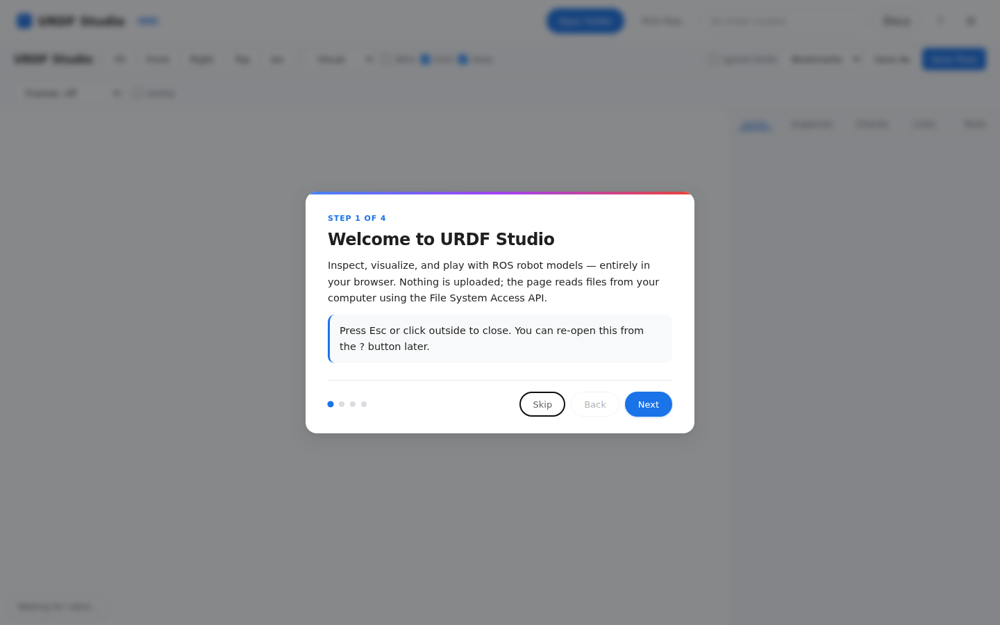
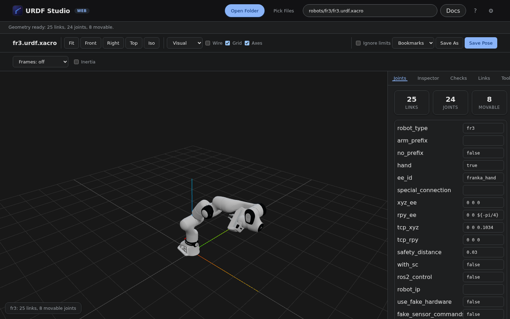
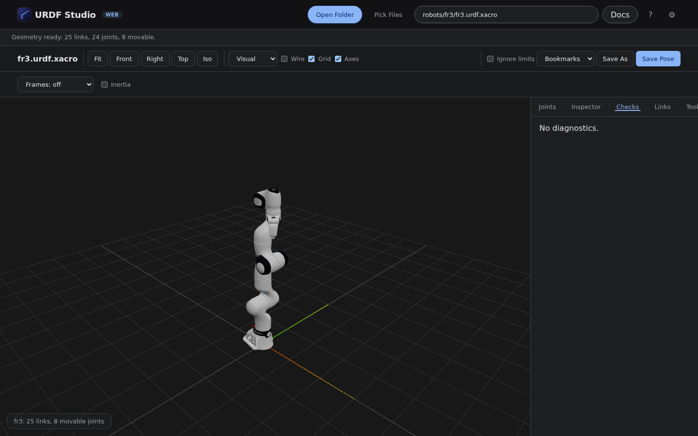
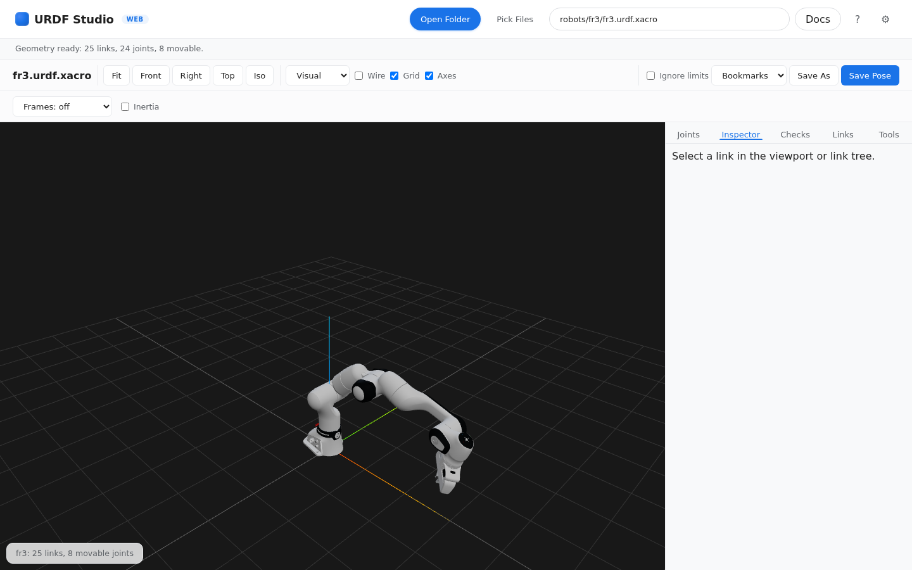
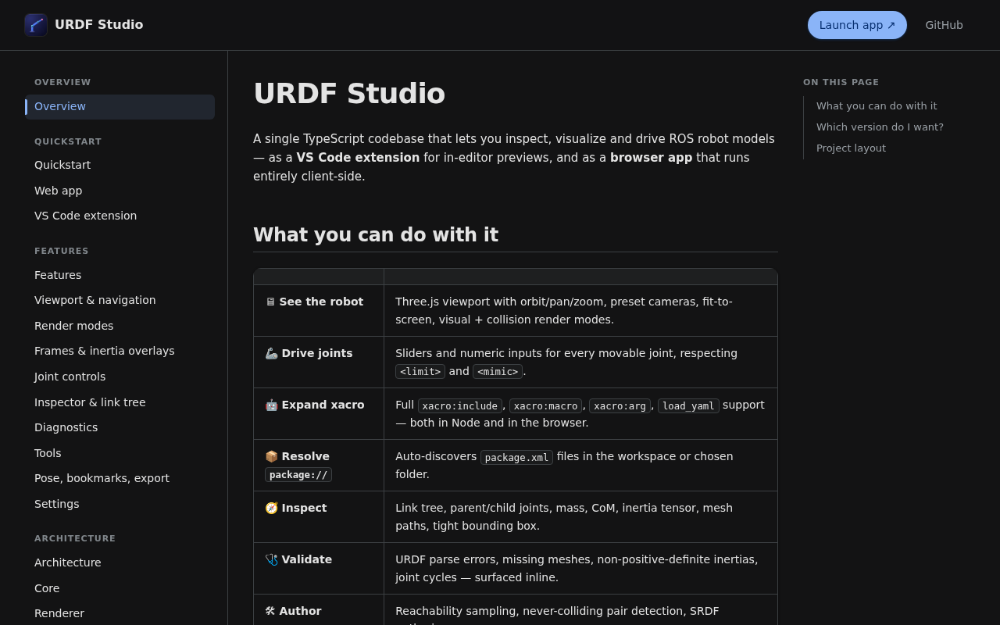
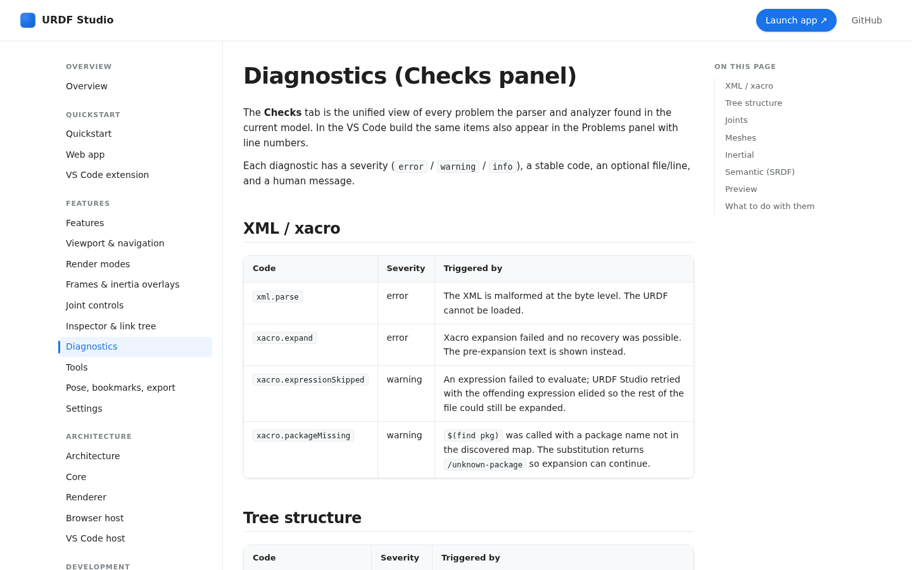

<h1 align="center">
  
  <br>
  URDF&nbsp;Studio
</h1>

<p align="center">
  <strong>Inspect, visualize, and drive ROS robot models — in VS Code <em>and</em> in the browser.</strong>
</p>

<p align="center">
  <a href="https://urdf.deyuf.org"></a>
  <a href="https://marketplace.visualstudio.com/items?itemName=deyuf.urdf-studio"></a>
  <a href="https://marketplace.visualstudio.com/items?itemName=deyuf.urdf-studio"></a>
  <a href="LICENSE"></a>
</p>

<p align="center">
  
</p>

<p align="center">
  <em>Franka Research 3 loaded directly from a local <code>franka_description</code> checkout — full xacro expansion, packages resolved, meshes streamed via blob URLs. No server.</em>
</p>

---

## Table of contents

- [Quickstart](#quickstart)
- [How it looks](#how-it-looks)
- [Features](#features)
- [Tested models](#tested-models)
- [Configuration](#configuration)
- [Architecture](#architecture)
- [Local development](#local-development)
- [Deployment](#deployment)
- [Releasing](#releasing)
- [Contributing &amp; license](#contributing--license)

---

## Quickstart

URDF Studio ships two artifacts from one codebase. Pick the one that
matches how you work.

### Browser

1. Open [**urdf.deyuf.org**](https://urdf.deyuf.org) in Chrome / Edge / Brave / Arc.
2. Click **Open Folder** → pick a ROS package (try a cloned
   [`franka_description`](https://github.com/frankarobotics/franka_description)).
3. Pick a robot file from the dropdown. The viewport loads on the spot.

> Safari / iOS / Firefox don't expose the File System Access API — use
> the **Pick Files** button (`webkitdirectory` fallback) instead. Bytes
> never leave your machine either way.

### VS Code

1. Install [**deyuf.urdf-studio**](https://marketplace.visualstudio.com/items?itemName=deyuf.urdf-studio)
   from the Marketplace.
2. Right-click a `.urdf`, `.urdf.xacro`, or `.xacro` file → **Open With**
   → **URDF Studio Preview**.
3. The custom editor opens. Workspace package roots are auto-discovered.

Full docs: **<https://urdf.deyuf.org/docs/>**.

---

## How it looks

### Onboarding tour



The first visit shows a four-step tour explaining what the app does, how
to open a folder, where the joint controls live, and how to save your
work. It dismisses itself after the last step; the **?** button in the
topbar re-opens it at any time. The dismissed state is remembered per
browser profile.

### Dark theme



Light / dark theme follows `prefers-color-scheme`. The viewport
background, panel chrome, side bar, and gradient backdrop all swap
together; no per-component overrides. The Franka FR3 above is loaded
from a local `franka_description` checkout with two joints flexed.

### Checks panel



Every parse error, malformed inertia, missing mesh, or invalid joint
limit shows up in the **Checks** tab. Each diagnostic has a severity
(`error` / `warning` / `info`), a stable code, and an optional file
line. In the VS Code build the same items also appear in the Problems
panel.

### Inspector



Click any link in the viewport or in the **Links** tree to populate the
Inspector. It shows the parent and child joints with type/axis/limits,
mass, center of mass, the full inertia tensor with eigenvalues, and the
resolved absolute paths of every visual and collision mesh referenced
by that link. The selected link gets a tight yellow bounding box on
its own visual geometry.

### Docs site



The same Cloudflare Pages deployment serves the documentation at
`/docs/`. Three-column layout: section-grouped sidebar on the left, the
article in the middle, an in-page "On this page" TOC on the right.
Sidebar groups stay sticky while you scroll.

### Diagnostic catalog



The diagnostics page in the docs enumerates every check by stable code,
groups them by category (XML / xacro, tree structure, joints, meshes,
inertial, semantic), and explains what triggers each one and how to
silence it. Useful as a reference when authoring a URDF.

## Features

Feature pages in the docs go into much more detail; this is the
overview.

### 🖥 Viewing

| | |
|---|---|
| **3D viewport** | Orbit / pan / zoom (OrbitControls), presets (Front / Right / Top / Iso), one-click Fit. |
| **Render modes** | `Visual`, `Collision`, or `Both` — see [Render modes →](https://urdf.deyuf.org/docs/features/render-modes.html) |
| **Frames & inertia** | Per-link TF axes (off / selected / all) and inertia ellipsoids + CoM markers. |
| **Configurable up axis** | `+X`, `+Y`, `+Z` — grid and camera adjust together. |
| **Wireframe overlay** | Spot cracks, inverted normals, high-poly collision meshes. |

### 🦾 Driving

| | |
|---|---|
| **Joint sliders** | Live sliders + numeric inputs honoring `<limit>` for `revolute`, `continuous`, `prismatic`. |
| **Mimic propagation** | `<mimic>` joints follow their master, with limit-clamp bypass so propagation isn't truncated. |
| **Ignore limits** | One-click bypass of every joint's `<limit>` for exploration. |
| **Search & filter** | Substring filter, *only modified* toggle. |
| **Named states** | SRDF `<group_state>` blocks appear in the bookmark dropdown — see [Joints →](https://urdf.deyuf.org/docs/features/joints.html) |

### 🩺 Analysing

| | |
|---|---|
| **Checks panel** | Every parse error, missing mesh, malformed inertia, joint cycle. [Catalog →](https://urdf.deyuf.org/docs/features/diagnostics.html) |
| **Link tree & inspector** | Click anywhere on the robot or tree → see joints, mass, CoM, inertia tensor, mesh paths. |
| **Diagnostics in VS Code** | Same checks surface in the Problems panel with line numbers. |

### 🛠 Authoring

| | |
|---|---|
| **Reachability sampling** | Monte-Carlo workspace point cloud for any tip link. |
| **Never-colliding pairs** | Sample for `<disable_collisions>` entries → write merged SRDF. |
| **Pose & bookmarks** | Save pose, name bookmarks, restore on next open. |
| **Export & screenshot** | JSON pose with camera; PNG screenshot at native resolution. |

### 🤖 ROS / URDF / xacro

| | |
|---|---|
| **xacro expansion** | `xacro:include`, `xacro:macro`, `xacro:arg`, `load_yaml`, Python ternary / `**` / slice rewrites. |
| **`package://` URIs** | Auto-discovered from every `package.xml` in scope. |
| **Mesh formats** | STL · COLLADA · OBJ · glTF · GLB. DAE / GLTF external assets pre-resolved to blob URLs. |
| **SRDF** | Joint groups, named states, `disable_collisions`. |

---

## Tested models

End-to-end Playwright smoke test against the upstream
[`franka_description`](https://github.com/frankarobotics/franka_description)
package. Reproducer:

```bash
git clone https://github.com/frankarobotics/franka_description /tmp/franka_description
npm run web:build
FRANKA_DIR=/tmp/franka_description node scripts/test-franka.mjs
```

| Robot | Source | Result |
|---|---|---|
| Franka Research 3 (`fr3`) | franka_description | ✅ 8 joints · 25 links · 0 errors · 0 warnings · ~600 ms |
| Franka Research (`fer`)   | franka_description | ✅ 8 joints · 25 links · 0 errors · 0 warnings · ~800 ms |
| Franka Production 3 (`fp3`) | franka_description | ✅ 8 joints · 25 links · 0 errors · 0 warnings · ~600 ms |

The whole pipeline runs in the browser: directory pick, xacro expansion
(including `load_yaml` for joint limits / inertials YAMLs), package
resolution, mesh blob URL allocation, Three.js render.

---

## Configuration

Both targets expose the same five settings.

| Setting | Default | Effect |
|---|---|---|
| Default render mode | `visual` | Geometry layer on first load. |
| Up axis | `+Z` | World up axis used by camera and grid. |
| Default xacro args | `{}` | Args merged into every xacro file. |
| Extra package roots | `[]` | Extra `package.xml` scan roots. |
| Semantic files | `[]` | SRDF / YAML semantic files. |

**Web:** ⚙ button in the topbar → JSON in `localStorage`.
**VS Code:** `urdfStudio.*` keys in `settings.json`.

Details: [docs/features/settings →](https://urdf.deyuf.org/docs/features/settings.html)

---

## Architecture

A single TypeScript codebase produces both targets:

```
                src/core/                 — pure logic, no fs/path/DOM imports
                     ▲
       ┌─────────────┴─────────────┐
   io.node.ts                   ioBrowser.ts
   (jsdom + node:fs)            (FileSystemAccess + native DOM)
       ▲                              ▲
  src/extension.ts               src/web/host.ts
       ▲                              ▲
       └─────────── postMessage ──────┘
                     ▼
              src/renderer/main.ts     — Three.js + URDFLoader, identical
```

The core never touches Node-only modules directly; it queries a
`CoreIo` interface set by the host. The renderer is bundled separately
and is identical on both targets — the only thing that differs is the
postMessage source.

Deep dive: [docs/architecture →](https://urdf.deyuf.org/docs/architecture/)

---

## Local development

```bash
git clone https://github.com/deyuf/urdf-studio
cd urdf-studio
npm ci
```

Common loops:

```bash
# VS Code extension
npm run watch              # incremental rebuild; press F5 in VS Code

# Web app
npm run web:dev            # http://127.0.0.1:5173 with HMR

# Docs only
npm run docs:watch         # rebuild dist-web/docs on every .md change

# Tests
npm run test:unit          # 24 node:test cases on src/core
npx playwright test        # 19 renderer + web shell specs

# Real-world smoke
FRANKA_DIR=/tmp/franka_description node scripts/test-franka.mjs
```

Production builds:

```bash
npm run package            # VS Code extension (dist/)
npm run web:build          # web app + docs (dist-web/)
npm run vsce:package       # .vsix for sideload / Marketplace
```

More: [docs/development/building →](https://urdf.deyuf.org/docs/development/building.html)

---

## Deployment

Web app and docs auto-deploy to Cloudflare Pages on every push to
`main`. Three workflows under `.github/workflows/`:

| File | Trigger | Effect |
|---|---|---|
| `ci.yml` | every push/PR | type-check + unit + Playwright |
| `preview-web.yml` | PR | per-PR preview deployment, URL commented on the PR |
| `deploy-web.yml` | push to `main` | production deployment |

Required GitHub secrets: `CLOUDFLARE_API_TOKEN`, `CLOUDFLARE_ACCOUNT_ID`.
First-time Pages project setup:

```bash
npx wrangler pages project create urdf-studio --production-branch=main
```

Custom domain (if your zone is already on Cloudflare): just add
`urdf.example.com` under **Pages → urdf-studio → Custom domains**.
CI config doesn't change.

Step-by-step:
[docs/development/deployment →](https://urdf.deyuf.org/docs/development/deployment.html)

---

## Releasing

`.github/workflows/publish.yml` publishes to the VS Code Marketplace on
every push to `main` whose `package.json#version` changed. The web app
is continuously deployed; no version bump needed.

To cut an extension release: bump `version`, commit, push to `main`.

More: [docs/development/releasing →](https://urdf.deyuf.org/docs/development/releasing.html)

---

## Contributing & license

PRs welcome. Each PR triggers CI (typecheck + tests) and a Cloudflare
Pages preview deployment with a URL commented on the PR.

License: [MIT](LICENSE).
