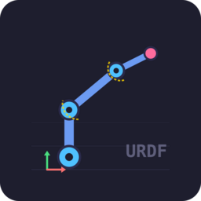

# URDF Studio

<p align="center">
  
</p>

<p align="center">
  <b>Inspect, visualize, and interact with URDF &amp; xacro robot models — directly inside VS Code.</b>
</p>

<p align="center">
  <a href="https://marketplace.visualstudio.com/items?itemName=deyuf.urdf-studio">
    
  </a>
  <a href="https://marketplace.visualstudio.com/items?itemName=deyuf.urdf-studio">
    
  </a>
  <a href="https://marketplace.visualstudio.com/items?itemName=deyuf.urdf-studio">
    
  </a>
  <a href="https://marketplace.visualstudio.com/items?itemName=deyuf.urdf-studio">
    
  </a>
  <a href="https://github.com/deyuf/urdf-studio/blob/main/LICENSE">
    
  </a>
</p>

---

## Features

### 🖥️ Interactive 3D Viewer

A full Three.js viewport embedded in VS Code with orbit, pan, and zoom controls. Supports preset camera angles (**Front**, **Right**, **Top**, **Iso**) and a one-click **Fit** to frame the entire robot.

### 🤖 URDF & Xacro Support

Opens `.urdf`, `.urdf.xacro`, and `.xacro` files natively as a custom editor. Xacro files are expanded on-the-fly with full argument support — edit xacro args and hit **Reload xacro** to see changes instantly.

### 🦾 Joint Controls

Interactive sliders and numeric inputs for every movable joint. Supports **revolute**, **continuous**, and **prismatic** joint types with proper limits. Toggle **Ignore limits** mode to freely explore the full range of motion.

### 📦 ROS Package Resolution

Automatically discovers `package.xml` files across your workspace and resolves `package://` URIs for meshes. Add custom package search roots via settings for multi-workspace setups.

### 🎨 Render Modes

Switch between three geometry layers:

| Mode | Description |
|------|-------------|
| **Visual** | Render visual meshes (default) |
| **Collision** | Render collision geometry only |
| **Both** | Overlay both layers simultaneously |

Toggle **wireframe** mode to inspect mesh topology. Show or hide the **grid** and **axes** helpers.

### 🌲 Link Tree & Inspector

Browse the full kinematic tree in a collapsible hierarchy. Click any link in the tree or directly in the 3D viewport to inspect it — view parent/child joints, joint type, axis, limits, and associated meshes.

### 🩺 Model Diagnostics

Real-time analysis of your robot model surfaced as VS Code diagnostics (errors, warnings, info). Catches issues like:

- Missing mesh files
- Undefined joints or links
- Xacro expansion problems
- Invalid joint limits

Diagnostics also appear in the **Checks** panel inside the preview for quick triage.

### 📐 SRDF & Named States

Load SRDF or YAML semantic files to define **joint groups** and **named states** (e.g., "home", "ready", "tucked"). Apply named states with a single click to pose the robot instantly.

### 💾 Pose Save & Export

- **Save Pose** — persists the current joint configuration and camera so it's restored on next open.
- **Export Pose** — opens a JSON document with the full joint pose and camera snapshot for use in launch files or configuration.

### 📸 Screenshot Capture

Capture a PNG screenshot of the current viewport and save it to your workspace. Perfect for documentation, PRs, or sharing robot configurations.

### ⚙️ Mesh Format Support

Loads common robotics mesh formats out of the box:

- **STL** — with auto-generated normals
- **COLLADA (.dae)**
- **OBJ**
- **glTF / GLB**

### 🔧 Configurable Up Axis

Set the world up axis to **+X**, **+Y**, or **+Z** depending on your robot's coordinate convention. The grid, camera, and orbit controls adjust automatically.

---

## Quick Start

1. Install the extension from the [VS Code Marketplace](https://marketplace.visualstudio.com/items?itemName=deyuf.urdf-studio)
2. Open any `.urdf` or `.xacro` file
3. The 3D preview opens automatically, or use the command **URDF Studio: Open Preview**

---

## Commands

| Command | Description |
|---------|-------------|
| `URDF Studio: Open Preview` | Open the 3D preview for the active URDF/xacro file |
| `URDF Studio: Recenter` | Reset the camera to frame the robot |
| `URDF Studio: Export Pose` | Export current joint pose as JSON |
| `URDF Studio: Capture Screenshot` | Save a PNG screenshot of the viewport |

---

## Settings

| Setting | Default | Description |
|---------|---------|-------------|
| `urdfStudio.packageRoots` | `[]` | Additional directories to scan for ROS packages |
| `urdfStudio.defaultXacroArgs` | `{}` | Default argument values for xacro expansion |
| `urdfStudio.defaultRenderMode` | `"visual"` | Initial geometry layer (`visual`, `collision`, `both`) |
| `urdfStudio.upAxis` | `"+Z"` | World up axis (`+X`, `+Y`, `+Z`) |
| `urdfStudio.semanticFiles` | `[]` | SRDF or YAML files for joint groups and named states |

---

## Development

```bash
npm install
npm run compile
```

Open this folder in VS Code and press **F5** to launch the Extension Host. Use `URDF Studio: Open Preview` on any `.urdf`, `.urdf.xacro`, or `.xacro` file.

```bash
npm run test:unit       # Run unit tests
npm run test:renderer   # Run Playwright renderer tests
```

---

## License

[MIT](LICENSE)
